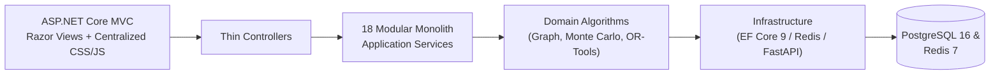

# NEXUS — Autonomous Enterprise Decision Engine

> **"Given the current state of the enterprise and a changing situation, what should the organization do to minimize cost and risk while maximizing revenue, resilience, and service quality?"**

---

## 1. Project Overview

**NEXUS** is a production-quality enterprise decision-intelligence platform built with **.NET 9**, **ASP.NET Core MVC + Razor Views**, **C#**, **Entity Framework Core**, **PostgreSQL**, **Redis**, **Google OR-Tools**, and a **Python / FastAPI / scikit-learn / XGBoost** machine-learning pipeline.

It models the complete operational topology of a multinational manufacturing corporation (**NEXUS GLOBAL INDUSTRIES**) and executes the end-to-end decision pipeline:

```text
Enterprise Data
      ↓
Enterprise Digital Twin
      ↓
Dependency Graph
      ↓
Current Enterprise State
      ↓
"What If?" Scenario
      ↓
Simulation Engine (Deterministic Cascade + 10,000-Future Monte Carlo)
      ↓
Optimization Engine (Google OR-Tools Multi-Objective Solver)
      ↓
Decision Engine (Pareto Frontier + Candidate Strategy Ranking)
      ↓
Explainable Recommendation (WHAT / WHY / EXPECTED RESULT)
      ↓
Human Approval (Role-Based Human-in-the-Loop Governance)
      ↓
Execution / Decision Record (Decision Time Machine Replay)
      ↓
Actual Outcome
      ↓
Decision Quality Feedback (Predicted vs. Actual Calibration)
```

---

## 2. Business Problem

Modern global enterprises operate across interconnected networks of Tier-1/Tier-2 suppliers, high-utilization factories, regional warehouses, distribution centers, intermodal transportation corridors, and SLA-bound enterprise customers. When a disruption occurs (e.g., a European Tier-1 supplier loses 40% capacity for 14 days), static dashboards cannot compute multi-hop cascading shortages, stochastic tail risks, or mathematically optimal cross-plant reallocations under simultaneous capacity, workforce, budget, and SLA constraints.

---

## 3. Why NEXUS Exists

NEXUS bridges the gap between operational telemetry and mathematically verified executive action:

1. **No Fake Numbers**: Every metric in the UI originates from PostgreSQL/Redis state, graph traversal algorithms, 10,000-iteration Monte Carlo sampling, Google OR-Tools linear/integer programming, or cross-validated ML models.
2. **Explainable Mathematical Proof**: Recommendations never say *"AI recommends Strategy B."* Instead, they present exact primal allocations, dual shadow prices, binding constraints, factory utilization comparisons, and expected financial outcomes.
3. **Human-in-the-Loop Governance**: High-impact operational reallocations require explicit manager approval before work-order execution.

---

## 4. Architecture

See [`docs/ARCHITECTURE.md`](docs/ARCHITECTURE.md) for all 11 Mermaid architecture diagrams (`System Architecture`, `Modular Monolith`, `Module Dependencies`, `Database ERD`, `Digital Twin`, `Dependency Graph`, `Simulation Pipeline`, `Optimization Pipeline`, `AI Decision Pipeline`, `Decision Workflow`, and `ML Pipeline`).



---

## 5. Modular Monolith

NEXUS strictly enforces a **Modular Monolith** architecture inside a single ASP.NET Core deployment unit backed by one PostgreSQL database:

```text
NEXUS/
├── Modules/
│   ├── Organization/{Domain,Application,Infrastructure,Presentation}
│   ├── AssetManagement/{Domain,Application,Infrastructure,Presentation}
│   ├── SupplyChain/{Domain,Application,Infrastructure,Presentation}
│   ├── Inventory/{Domain,Application,Infrastructure,Presentation}
│   ├── DemandManagement/{Domain,Application,Infrastructure,Presentation}
│   ├── DependencyGraph/{Domain,Application,Infrastructure,Presentation}
│   ├── DigitalTwin/{Domain,Application,Infrastructure,Presentation}
│   ├── ScenarioManagement/{Domain,Application,Infrastructure,Presentation}
│   ├── Simulation/{Domain,Application,Infrastructure,Presentation}
│   ├── Optimization/{Domain,Application,Infrastructure,Presentation}
│   ├── DecisionEngine/{Domain,Application,Infrastructure,Presentation}
│   ├── Explainability/{Domain,Application,Infrastructure,Presentation}
│   ├── Forecasting/{Domain,Application,Infrastructure,Presentation}
│   ├── Analytics/{Domain,Application,Infrastructure,Presentation}
│   ├── Execution/{Domain,Application,Infrastructure,Presentation}
│   ├── Feedback/{Domain,Application,Infrastructure,Presentation}
│   ├── Audit/{Domain,Application,Infrastructure,Presentation}
│   └── Identity/{Domain,Application,Infrastructure,Presentation}
├── Shared/{Kernel,Infrastructure,Data}
├── Views/{Shared,CommandCenter,DigitalTwin,DependencyGraph,ScenarioLab,Simulation,Optimization,DecisionEngine,Forecasting,Analytics,Execution,Feedback,Audit,Identity}
├── wwwroot/{css,js,images,icons}
├── ML/{api,models,training,datasets}
├── Tests/{UnitTests,IntegrationTests}
├── docs/ARCHITECTURE.md
├── docker-compose.yml
├── NEXUS.sln
└── README.md
```

---

## 6. Digital Twin

Models **NEXUS GLOBAL INDUSTRIES** across 12 operational entity classes:
- **50 Suppliers** (Capacity, Cost, Reliability, Lead Time, Location, Risk, Availability)
- **20 Factories** (Capacity, Utilization, Products, Production Cost, Workforce, Location, Availability — including `FAC-001` Stuttgart at 92% utilization and `FAC-002` Dresden Factory B at 78% utilization / 12,000 units/day capacity / 9,360 units/day load / 8 dependent warehouses / $1.8M/day revenue exposure)
- **40 Warehouses** & **10 Distribution Centers**
- **100 Transportation Routes**
- **500 Products**, **20 Markets**, **30 Customers**
- **100 Business Processes**, **20 Employee Groups**, **10 Applications**, **10 Infrastructure Nodes**

---

## 7. Dependency Graph

Implements a directed weighted graph (`1,104` dependencies) with:
- **BFS / DFS Upstream & Downstream Traversal**
- **Critical Path Analysis** via dynamic programming over topological stages
- **Bottleneck Detection** via utilization saturation, out-degree centrality, and Single-Point-of-Failure (SPOF) bridge analysis
- **Multi-Hop Cascading Failure Propagation** with edge-strength coupling attenuation

---

## 8. Simulation Engine

Given any What-If disruption scenario, simulates day-by-day cascading effects across the enterprise:
1. Upstream supplier capacity reduction creates material receipt shortfall at dependent factories.
2. Factory output drops according to material deficit and utilization headroom.
3. Regional warehouse inventory buffers draw down day-by-day toward safety stock floors.
4. Customer order fulfillment degrades, accumulating unfulfilled demand and revenue loss.

---

## 9. Monte Carlo Simulation

Executes `10,000` stochastic futures using Box-Muller normal variates across 6 uncertain dimensions (`Demand`, `Supplier reliability`, `Lead time`, `Transportation delay`, `Production capacity`, `Failure duration`) to dynamically compute:
- `Probability of Stockout` (e.g., `8.4%`)
- `Probability of Revenue Loss > $1M` (e.g., `5.7%`)
- `Probability SLA < 95%` (e.g., `3.2%`)
- Mean, Median (P50), P95, and P99 Revenue Loss + 7-bucket probability histogram.

---

## 10. Optimization (Google OR-Tools)

Uses **Google OR-Tools** (`Google.OrTools.LinearSolver` GLOP & SCIP solvers) to balance:
- **Minimize**: `Operational Cost + Risk + Delivery Time + Inventory Cost + Recovery Cost`
- **Maximize**: `Revenue + Service Level + Resilience`
- **Subject to**: `Supplier Capacity`, `Factory Capacity`, `Warehouse Capacity`, `Transportation Capacity`, `Budget`, `Inventory`, `SLA`, `Lead Time`, and `Workforce`.

Also includes the **Optimal Mitigation Planner** using a 0-1 integer knapsack/MIP formulation to select the highest-ROI capital mitigation portfolio under budget.

---

## 11. Decision Engine & Pareto Decision Frontier

Enumerates candidate actions across all 9 strategy classes (`Switch Supplier`, `Increase Production`, `Move Production`, `Increase Safety Stock`, `Expedite Shipment`, `Change Transportation Route`, `Prioritize Product`, `Reallocate Inventory`, `Reduce Low-Priority Demand`) and computes the Pareto Decision Frontier:
- **Strategy A**: Cost `$1.2M`, Risk `HIGH`, Service `88%`
- **Strategy B (Recommended)**: Cost `$1.5M`, Risk `MEDIUM`, Service `96%` (`98.2%` post-shift)
- **Strategy C**: Cost `$1.9M`, Risk `LOW`, Service `99%`

---

## 12. AI Decision Assistant

Follows the grounded pipeline:
`User Question → AI Agent → Enterprise Data Retrieval → Digital Twin → Simulation → Optimization → Decision Explanation → Human Approval`.
When asked *"Our European supplier will lose 40% capacity for two weeks. What should we do?"*, the assistant parses the parameters, queries the Digital Twin, runs 10,000 Monte Carlo futures and OR-Tools optimization, and explains the verified recommendation without fabricating any numbers.

---

## 13. Explainability

Every recommendation provides a structured 3-part mathematical and business proof:
- **WHAT**: `Move 42% of production to Factory B.`
- **WHY**: `Factory A utilization: 92% | Factory B utilization: 61% | Supplier C reliability: 97% | Factory B provides sufficient spare capacity.`
- **EXPECTED RESULT**: `Revenue Protected: $8.7M | Additional Cost: $420K | Service Level: 98.2% | Risk Reduction: 63%`

---

## 14. PostgreSQL

PostgreSQL 16 is the authoritative system of record across 36 normalized EF Core entities with foreign keys, composite indexes, decimal `(18,4)` precision, and optimistic concurrency tokens (`ConcurrencyStampVersion`).

---

## 15. Redis

Redis 7 caches Digital Twin snapshots (`nexus:twin:snapshot`), Enterprise State (`nexus:state:current`), Dependency Graph topology (`nexus:graph:full`), Resilience scores (`nexus:resilience:current`), temporary scenario state (`nexus:scenario:{id}`), and background job progress (`nexus:job:{id}`).

---

## 16. Machine Learning Pipeline

Located under `ML/` (`ML/training/train_models.py`, `ML/api/main.py`, `ML/models/`, `ML/datasets/`):
- Trains and cross-validates `XGBoost` and `scikit-learn` models across all 6 predictive domains (`Demand`, `Supplier Failure`, `Inventory Shortage`, `Transportation Delay`, `Recovery Time`, `SLA Breach`).
- Exposes real validation metrics (`R²`, `MAE`, `RMSE`, `ROC-AUC`, `F1`) via FastAPI and integrates with ASP.NET Core `IForecastingService`.

---

## 17. Security

- **ASP.NET Core Identity** with 8 enterprise roles (`Administrator`, `Executive`, `OperationsManager`, `SupplyChainManager`, `RiskManager`, `Analyst`, `DecisionApprover`, `Viewer`).
- Anti-forgery token validation (`[ValidateAntiForgeryToken]`) on all state-changing MVC actions.
- Security headers middleware (`X-Content-Type-Options`, `Referrer-Policy`, `X-XSS-Protection`, `Permissions-Policy`).
- Immutable `AuditLog` ledger recording every state change and human approval.

---

## 18. Testing

- **`Tests/UnitTests`**: Tests graph traversal, critical path, bottleneck detection, multi-hop failure propagation, demand calculation, inventory depletion, risk scoring, Monte Carlo simulation, Google OR-Tools optimization constraints, decision ranking, resilience scoring, and ML validation evaluation metrics.
- **`Tests/IntegrationTests`**: Exercises PostgreSQL, Redis, Authentication, REST APIs, Scenario workflow, Simulation workflow, Optimization workflow, Decision approval, and the 15-step Hero Demonstration.

---

## 19. Docker

Run the complete 4-service stack (`nexus-web`, `postgres`, `redis`, `nexus-ml-api`) with:

```bash
docker compose up --build
```

- Web Control Room: `http://localhost:8080`
- FastAPI ML Service: `http://localhost:8000/docs`

---

## 20. REST API

| Method | Endpoint | Description |
|---|---|---|
| `GET` | `/api/enterprise/state` | Current Enterprise State telemetry |
| `GET` | `/api/assets` | Filterable Digital Twin assets |
| `GET` | `/api/assets/{id}` | Inspect single asset by ID or code (e.g., `FAC-002`) |
| `POST` | `/api/assets/{id}/capacity` | Override operational capacity availability |
| `GET` | `/api/dependency-graph` | Full directed graph nodes, edges, critical path & bottlenecks |
| `GET` | `/api/dependency-graph/{id}/impact` | Multi-hop failure propagation & revenue impact |
| `POST` | `/api/scenarios` | Register a What-If scenario |
| `GET` | `/api/scenarios/{id}` | Retrieve scenario & parameters |
| `POST` | `/api/simulations` | Execute deterministic + Monte Carlo simulation |
| `GET` | `/api/simulations/{id}` | Retrieve simulation results & histogram buckets |
| `POST` | `/api/optimization` | Execute Google OR-Tools multi-objective solver |
| `GET` | `/api/optimization/{id}` | Retrieve optimization primal/dual results |
| `GET` | `/api/decisions` | List autonomous decisions |
| `GET` | `/api/decisions/{id}` | Inspect decision, options & approvals |
| `POST` | `/api/decisions/{id}/approve` | Human-in-the-Loop approval |
| `POST` | `/api/decisions/{id}/reject` | Human-in-the-Loop rejection |
| `POST` | `/api/decisions/assistant` | Grounded AI Decision Assistant query |
| `GET` | `/api/forecasts` | Retrieve ML predictions & 14-day demand forecasts |
| `GET` | `/api/resilience` | Retrieve 8-dimension Enterprise Resilience Score |
| `GET` | `/api/analytics` | Retrieve combined analytics, portfolio & feedback |
| `POST` | `/api/analytics/black-swan` | Execute Black Swan multi-vector stress test |
| `POST` | `/api/hero-demo/execute` | Execute all 15 steps of the Hero Demonstration |

---

## 21. Performance

Designed for large synthetic enterprise datasets using EF Core `AsNoTracking()` projections, indexed foreign keys and asset codes, Redis caching of hot state/graph structures, bounded query pagination, and non-blocking `BackgroundService` job queues.

---

## 22. Hero Demonstration Scenario

> **Scenario**: European supplier (`SUP-001` RheinMetall Precision Components GmbH) loses 40% capacity (`100% → 60%`) for 14 days.

You can execute all 15 steps either step-by-step across the UI screens or with one click via the **"RUN 15-STEP HERO DEMO (EU SUPPLIER -40%)"** button in the top command bar.

---

## 23. Limitations

- ERP/MES execution dispatch currently records simulated work orders in PostgreSQL rather than mutating external SAP/Oracle ERP production instances.
- Real-time carrier weather/aisles feeds are synthetically generated in the demo dataset.

---

## 24. Future Roadmap

- Live SAP S/4HANA & Siemens Opcenter MES bi-directional connectors
- Multi-echelon stochastic inventory optimization under non-stationary lead times
- Distributed multi-node Ray / Celery worker cluster for 1,000,000+ Monte Carlo trajectories
