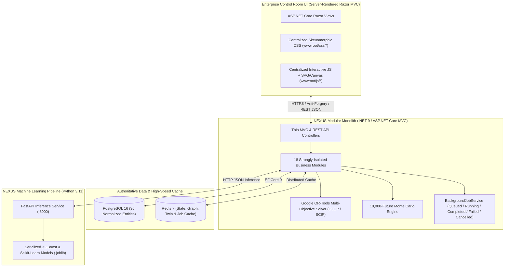
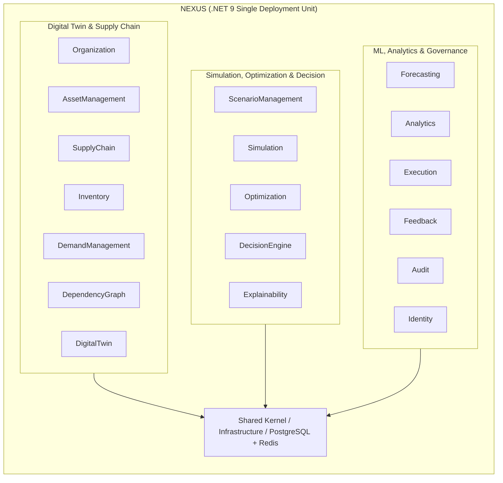
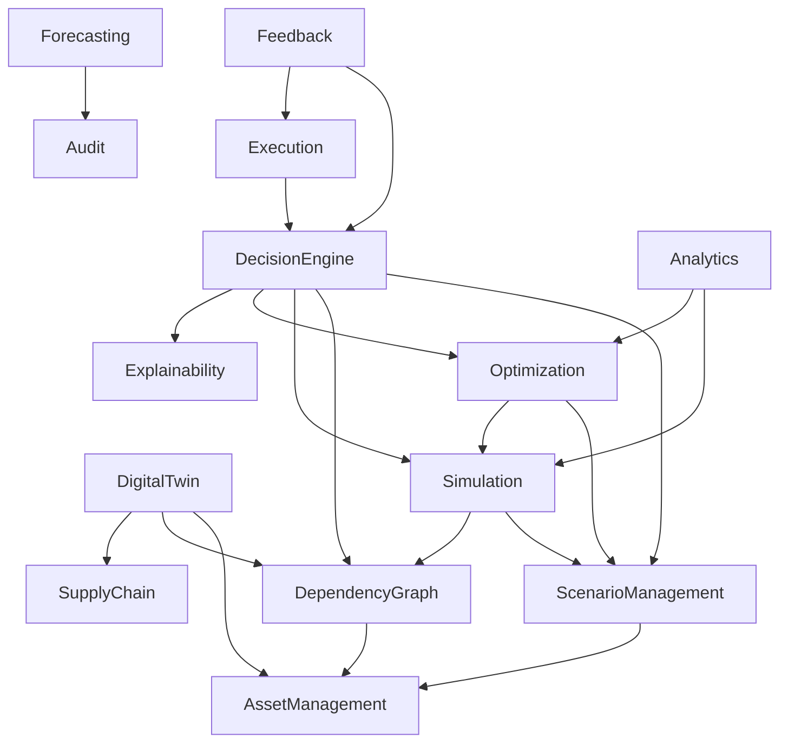
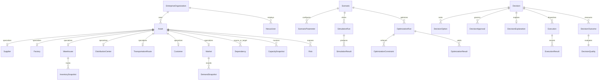
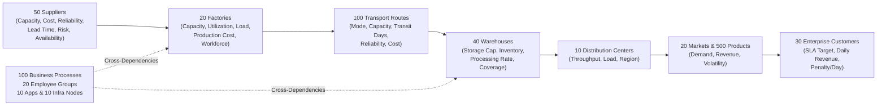
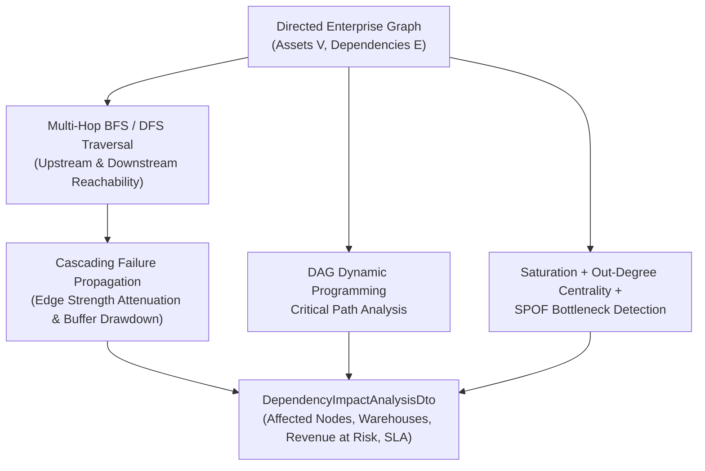
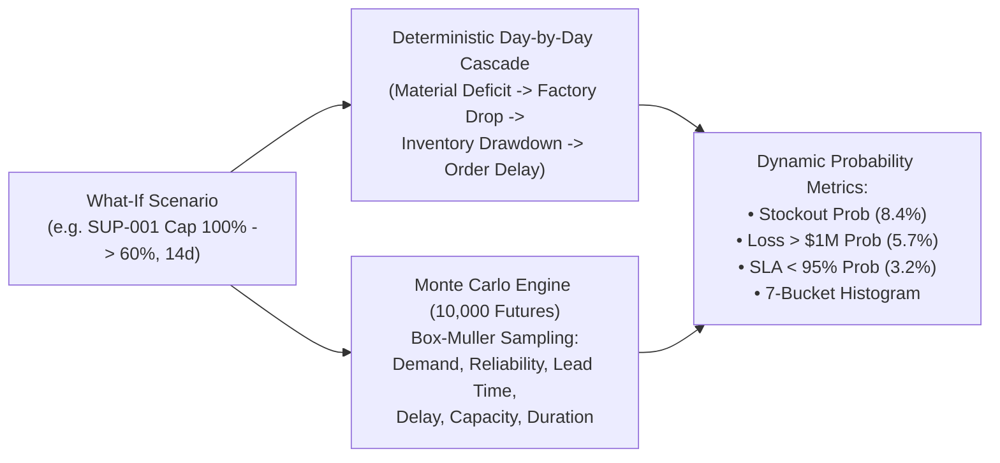
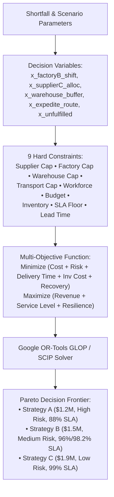
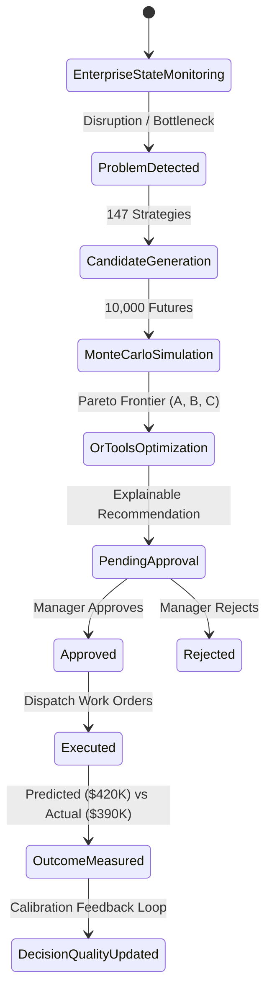
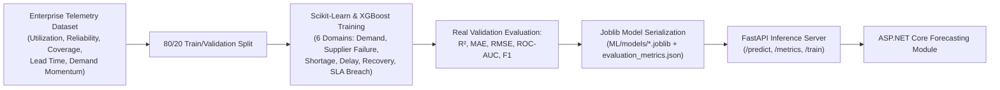

# NEXUS — Architecture & Engineering Reference

**Autonomous Enterprise Decision Engine**

This document contains the complete architectural specification and all 11 required Mermaid diagrams for **NEXUS**.

---

## 1. System Architecture



---

## 2. Modular Monolith Structure



---

## 3. Module Dependencies



---

## 4. Database ERD



---

## 5. Digital Twin Model



---

## 6. Dependency Graph Algorithms



---

## 7. Simulation Pipeline (Deterministic Cascade + Monte Carlo)



---

## 8. Optimization Pipeline (Google OR-Tools)



---

## 9. AI Decision Pipeline

```mermaid
sequenceDiagram
    participant User as Operator / Executive
    participant AI as Grounded AI Agent
    participant Twin as Digital Twin & Graph
    participant Sim as Monte Carlo Engine
    participant Opt as Google OR-Tools
    participant Gov as Human-in-the-Loop

    User->>AI: "Our European supplier will lose 40% capacity for two weeks. What should we do?"
    AI->>Twin: Identify SUP-001 & traverse 26 downstream dependencies
    Twin-->>AI: $9.12M unmitigated exposure across FAC-001, WH-001..WH-008
    AI->>Sim: Execute 10,000 stochastic simulations
    Sim-->>AI: Stockout Prob 8.4%, P95 Loss $11.68M
    AI->>Opt: Solve multi-objective LP/MILP across 147 candidates
    Opt-->>AI: Recommend Strategy B (Move 42% to Factory B + Supplier C)
    AI-->>User: Grounded Explainable Recommendation (WHAT / WHY / EXPECTED RESULT)
    User->>Gov: Manager Reviews & Approves Strategy B
```

---

## 10. Decision Workflow & Human-in-the-Loop



---

## 11. Machine Learning Pipeline


